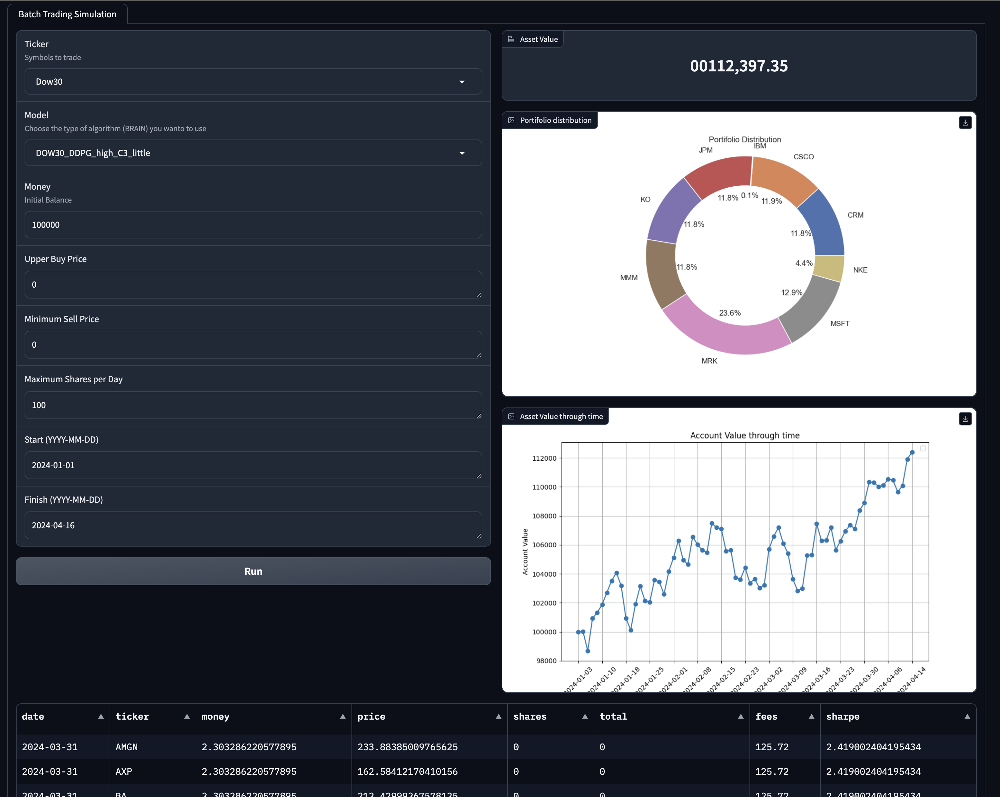

# Br@in Simulator
This repository is part of an Academic project for building a stock trading project for the final term post graduation AI Course. This repository contains the tool we created to test and compare our models using historical data.

It uses Gradio lib for the interface and a Custom trading environmento based on FinRL.

Here an example run:

